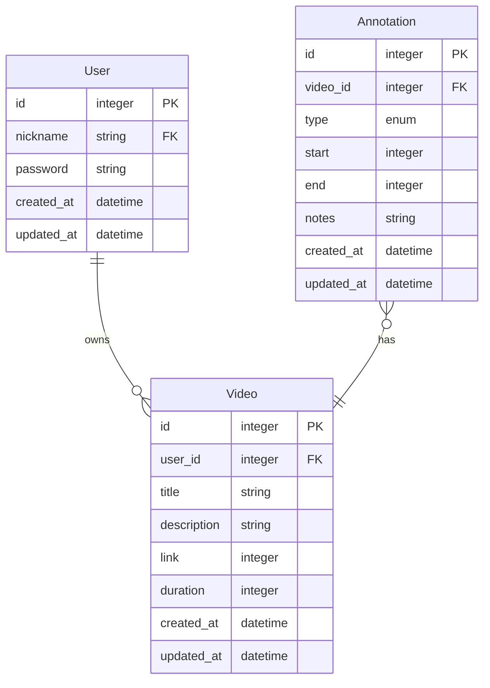

# 🧑🏽‍💻 Project: `NoteVook`
[](https://opensource.org/licenses/BSD-3-Clause) [](https://github.com/zatarain/note-vook/actions/workflows/pipeline.yml) [](https://codecov.io/gh/zatarain/note-vook)

This project aims to be an exercise to discuss about software engineering technical topics like software development, pair programming, testing, deployment, etcetera. More specifically, to discuss the development of an [API (Application Programming Interface)][what-is-api] to **manage annotations for videos** implemented written in [go programming language][go-lang].
## 📂 Table of content
* 📹 [Overview](#📹-overview)
	- ☑️ [Requirements](#☑️-requirements)
	- 🤔 [Assumptions](#🤔-assumptions)
* 📐 [Design](#📐-design)
	- 📊 [Data model](#📊-data-model)
		* 🎞️ [Video](#🎞️-video)
		* ✍🏽 [Annotation](#✍🏽-annotation)
		* 👤 [User](#👤-user)
	- 🔀 [Workflows](#🔀-workflows)
* 🏗️ [Implementation details](#🏗️-implementation-details)
  - 📦 [Dependencies](#📦-dependencies)
	- 🗄️ [Storage](#🗄️-storage)
* 📚 [References](#📚-references)

## 📹 Overview
This simple API aims to manage a video annotations database, this means we will have a collection of videos and we will be able to add text notes for some given interval of time of the videos. Additionally we would like to manage some basic security layer based-on [JWT (JSON Web Token)][what-is-jwt]. The application should be ready to deploy as a [Docker][docker] container, so we need to generate an image for it available to download in [Docker Hub][docker-hub].

### ☑️ Requirements
The API should be able to manage a database for the videos and each video may have many annotations related to it. An annotation allow s to capture time related information about the video. For example, we may want to creat an annotation that references to a part of the video from `04:00:00` to `00:05:00`.

 Allowing the client to perform following operations:
 * **List all the vide.** It should return the list of all videos in the system.
 * **Create a vide.** It should insert a new record for video provided by the client that includes some metadata.
 * **Update a video.** It should allow the client to update the information of a given video.
 * **Delete a video.** The API should provide an end-point to delete videos from the system.
 * **View video details.** It should show the details of a single video provided by the client.
 * **Annotate a video.** It should create a new annotation for a video with `start` and `end` time.
 * **Update annotations.** The API should allow the client to update annotation details.
 * **Delete annotations.** The API should provide a mechanism to delete annotations.
 * **Security layer.** It should implement a security layer based-on JWT.

### 🤔 Assumptions
This is a small example and it's not taking care about some corner case scenarios like following:
 * The videos can only be annotated by the user creator.
 * A video with the same link can be added multiple times.
 * Users can anonymously be created in the system.

## 📐 Design
The architecture will be a HTTP microservice that will consume some configuration and use ORM to represent the records in the database tables and also a Model-Controller (MC) pattern design, so the controllers will contain the handlers for the API requests, while the models will represent the data.

### 📊 Data model
In order to store and manipulate the data needed the API will rely on the entities shown in following diagram:


#### 🎞️ Video
This entity will represent the videos in the system and each record will be stored in the table `videos` which has following fields:

|    | Name          |     Type     | Description                                 |
|:--:| :---          |    :----:    | :---                                        |
| 🗝️ | `id`          | `INT`        | Auto-numeric identifier for the video       |
| ✳️ | `user_id`     | `INT`        | Foreign key for the user owner of the video |
| 🔤 | `title`       | `TEXT`       | Title of the video                          |
| 📄 | `description` | `BLOB`       | Description for the video                   |
| 🔤 | `link`        | `TEXT`       | Link for the video                          |
| 🔢 | `duration`    | `INT`        | Duration of the video in seconds            |
| 🗓️ | `created_at`  | `DATETIME`   | Timestamp representing the creation time    |
| 🗓️ | `updated_at`  | `DATETIME`   | Timestamp representing the last update time |

#### ✍🏽 Annotation
...

#### 👤 User
...

### 🔀 Workflows
...
```mermaid
sequenceDiagram
```

## 🏗️ Implementation details
We are using Golang as programming language for the implementation of the API operations. And the database is a single table in SQLite stored locally.

### 📦 Dependencies
We are using following libraries for the implementation:
 * **`gin-gonic`.** A web framework to implement a RESTful API via HTTP.
 * **`gorm`.** A library for Object Relational Model (ORM) in order to represent the records in the database as relational objects.
 * **`gorm` SQLite driver.** The database is a local storage implementing `SQLite`, so we need a wait to connect to it.
 * **`godotenv`.** This CLI tool allows us to load environment configuration via `.env` files and run a command.
 * **`crypto/bcrypt`.** To make use of `base64` encoding and decoding for the authentication token.
 * **`golang-jwt`.** To generate and use JSON Web Tokens (JWT) for authentication and authorisation.

And also, following ones for the development:
 * **`testify`.** To have more readable assertions on the unit testing.
 * **`mockery`.** To generate mocks used on unit testing.
 * **`monkey`.** To perform monkey patching on the unit testing.

### 🗄️ Storage
We will manage the persistency of the data with a 🪶 [SQLite][sqlite] database, which is a simple local storage database. 

## 📚 References

[what-is-api]: aws.amazon.com/what-is/api
[what-is-jwt]: https://jwt.io/introduction
[docker]: https://www.docker.com
[docker-hub]: https://hub.docker.com
[go-lang]: https://go.dev
[sqlite]: https://www.sqlite.org
